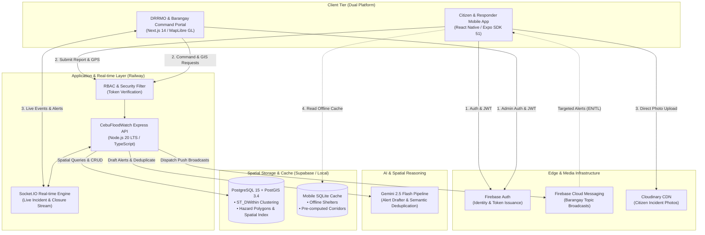
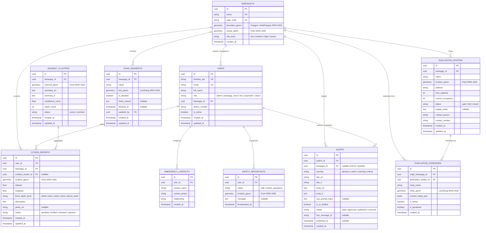
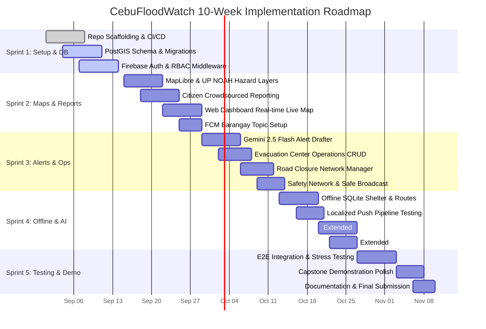

# Project Context — CebuFloodWatch (StormGate)

Durable, non-secret project facts. AI agents read this before making changes. Leave unknown fields as `<ASK_DEVELOPER>`; never guess.

Never store secrets here. Use placeholders such as `<HOSTING_RESOURCE>`, `<DATABASE_NAME>`, `<DATABASE_USER>`, and `<MCP_ALIAS>`.

---

## 1. Required Intake Status

- **Solution Cluster**: Disaster Risk Reduction & Emergency Management (DRRM)
- **Module**: Flood Warning, Evacuation Management, Citizen Crowdsourcing & Disaster Operations
- **Business purpose**: Provide a dual-platform (mobile + web) disaster response and monitoring system for Metro Cebu during flood events—empowering citizens with localized bilingual alerts, offline shelter directories, and crowdsourced reporting, while equipping City DRRMO admins and Barangay focal persons with real-time geospatial dashboards, AI-assisted alert generation, road closure controls, and shelter occupancy management.
- **Primary users**:
  - **General Public / Citizens**: Cebu City households, commuters, and evacuees accessing localized flood warnings, offline evacuation routes, hazard maps, and reporting flood depths.
  - **City DRRMO Admins**: Central Disaster Risk Reduction & Management Office operators overseeing city-wide flood maps, publishing emergency alerts, managing road passability, and monitoring evacuation facilities.
  - **Barangay Focal Persons**: Local barangay officials monitoring localized incidents, updating shelter status, and flagging local road blockages.
  - **First Responders**: Search and rescue units receiving real-time spatial incidents, navigation corridors, and field shelter updates.
- **Application type**: Dual-Platform System (Mobile App: React Native Expo; Web Dashboard: Next.js 14 App Router; Backend: Node.js Express REST API + WebSockets; Database: PostgreSQL 15 + PostGIS 3.4).

---

## 2. Tech Stack & Dependencies

- **Backend stack and version**: Node.js 20+ LTS / Express 4.x / TypeScript 5.x / Socket.IO 4.x
- **Frontend stack and version**:
  - **Web Dashboard**: Next.js 14 (App Router) / React 18 / TypeScript 5.x / MapLibre GL JS / TailwindCSS
  - **Mobile Application**: React Native (Expo SDK 51) / TypeScript 5.x / MapLibre React Native / `expo-sqlite` / `@react-native-firebase/messaging`
- **Database engine and version**: PostgreSQL 15 with PostGIS 3.4 extension (Hosted on Supabase / Railway)
- **Package manager / runtime versions**: `npm` / Node.js `v20.x` LTS
- **Authentication model**: Firebase Authentication (Bearer JWT verified via Firebase Admin SDK middleware with custom RBAC claims)
- **Data sensitivity / PII**: Medium (User phone numbers, real-time GPS locations, emergency contact directories, and citizen flood report photos)

### Validation Commands

- **Backend API**:
  - Build: `npm run build`
  - Unit Tests: `npm test`
  - Linter: `npm run lint`
- **Web Dashboard**:
  - Build: `npm run build`
  - Unit Tests: `npm test`
  - Linter: `npm run lint`
- **Mobile Application**:
  - Local Dev: `npx expo start`
  - Unit Tests: `npm test`
  - Linter: `npx expo lint`

### Stack & Library Decisions

- **Framework choice rationale**:
  - **React Native (Expo SDK 51)**: Enables unified cross-platform mobile deployment for iOS/Android, offline storage through `expo-sqlite`, and rapid prototyping via Expo Go.
  - **Next.js 14 (App Router)**: Provides optimal server-side rendering for initial dashboard state and low-latency geospatial rendering via MapLibre GL JS on desktop/tablet viewports.
  - **Node.js + Express + Socket.IO**: Ensures lightweight, event-driven bidirectional WebSocket communication between citizen report submissions and DRRMO operational dispatchers.
  - **PostgreSQL 15 + PostGIS 3.4**: Native spatial geometry types (`POINT`, `LINESTRING`, `POLYGON`) and spatial indexing (`GIST`) enabling lightning-fast `ST_DWithin` spatial proximity queries and hazard containment calculations.
  - **Google Gemini 2.5 Flash**: Fast inference and high token budget on the free tier for real-time bilingual English/Tagalog alert drafting and spatial-semantic incident report deduplication.
  - **Cloudinary**: Dedicated cloud media store for citizen flood verification photos with automatic thumbnail generation and zero local storage overhead.
- **Approved libraries**:
  - Mapping: `maplibre-gl` (web), `@maplibre/maplibre-react-native` (mobile), `@turf/turf` (geospatial operations)
  - Data & DB: `pg`, `pg-promise` / Drizzle ORM, `expo-sqlite` (mobile offline corridor store)
  - AI: `@google/genai` (Google Gen AI SDK for Gemini 2.5 Flash)
  - Real-time & Push: `socket.io`, `socket.io-client`, `firebase-admin`, `@react-native-firebase/app`, `@react-native-firebase/messaging`
  - UI & Utilities: `lucide-react` / `lucide-react-native`, `zod` (runtime schema validation), `date-fns`
- **Banned / disallowed libraries**:
  - Deprecated Google Maps API keys (use OpenStreetMap + MapLibre GL vectors)
  - Uncached live PAGASA web-scraping loops in request paths (use static/cached telemetry feeds)
  - Self-hosted Java-based GraphHopper engines in MVP production containers (use pre-computed SQLite corridor routing)
- **Formatter / linter config**: `eslint.config.js`, `.prettierrc`, `tsconfig.json`
- **Lockfile policy**: `package-lock.json` committed to Git
- **Data-access layer / pattern**: PostGIS SQL queries utilizing parameterized inputs, spatial indices (`ST_DWithin`, `ST_Intersects`), and repository pattern services.

---

## 3. Current Sprint Tasks

### Sprint: Sprint 1 (Weeks 1–2) — Foundation, Auth & Spatial Database

#### Module: Core Infrastructure & Identity

##### Feature: Project Scaffolding, PostGIS Database Schema & RBAC Setup

- [x] Initialize repository workspace containing Express API, Next.js Web Dashboard, and Expo Mobile App.
  - Validation commands: `npm run lint && npm run build` across all packages.
  - Success criteria: Monorepo / subproject directory structure established with clean dependency resolution.
- [x] Implement Supabase PostgreSQL 15 + PostGIS 3.4 database schema migrations (`users`, `barangays`, `citizen_reports`, `incident_clusters`, `evacuation_centers`, `road_segments`, `evacuation_corridors`, `alerts`, `emergency_contacts`).
  - Validation commands: Execute database migration runner scripts; verify spatial indices with `EXPLAIN ANALYZE SELECT * FROM citizen_reports WHERE ST_DWithin(location_geom, ST_SetSRID(ST_Point(123.89, 10.31), 4326), 150)`.
  - Success criteria: All 9 core tables and spatial indices created successfully with foreign key constraints.
- [x] Configure Firebase Auth integration and Express RBAC middleware.
  - Validation commands: Run auth middleware unit tests asserting role claims for `admin`, `barangay_focal`, and `first_responder`.
  - Success criteria: Valid Firebase JWTs grant scoped access; unauthorized requests return HTTP 401/403.
- [ ] Establish CI/CD pipelines targeting Railway (Backend API) and Vercel (Web Dashboard).
  - Validation commands: Trigger Git push to `staging` branch; verify green deployment runs.
  - Success criteria: Automatic preview deployments live on Vercel and Railway.

---

## 4. Scope & Non-Goals

- **Declared non-goals / out-of-scope (MVP)**:
  - Full self-hosted dynamic road routing engine (GraphHopper/Valhalla daemon); MVP utilizes pre-computed SQLite corridors with active passability penalty toggles.
  - Live fragile HTML scraping of PAGASA weather sensor web portals without SLA; MVP utilizes cached PAGASA telemetry datasets and sample feeds.
  - Automated PDF/Excel compliance reporting engines for OCD-7/CDRRMO; underlying log records are persisted, but visual report generator is deferred.
  - Offline vector tile generator pipeline (`.mbtiles` with `tilemaker` / `planetiler`); MVP provides offline SQLite shelter directory and static route vectors.
- **Deferred work pushed to a later phase**:
  - `[DEF-1]` Post-Disaster Audit & Compliance Export (PDF/Excel generator for CDRRMO and OCD-7 records).
  - `[DEF-2]` Live PAGASA AWS Telemetry Integration (Formal API contract or dedicated telemetry ingestion daemon).
  - `[DEF-3]` Full Self-Hosted GraphHopper / Valhalla Dynamic Impedance Routing Engine.

---

## 5. System Boundaries

- **What the system does**:
  - Ingests crowdsourced flood reports (GPS coordinates, flood depth tier, description, photo) from citizen mobile apps in < 3 taps.
  - Renders live hazard maps combining UP NOAH flood overlays (5/25/100-year return periods), real-time report pins, road closures, and shelter occupancy.
  - Drafts bilingual (English & Tagalog) early warning alerts via Google Gemini 2.5 Flash for DRRMO review and dispatches targeted FCM push notifications.
  - Operates offline on mobile by providing cached shelter locations and 3 pre-computed safe evacuation corridors per barangay.
  - Enforces territorial and operational RBAC separating City DRRMO Admins, Barangay Focals, and First Responders.
- **What the system does NOT do**:
  - Does not directly control physical floodgates, sirens, or municipal storm barriers.
  - Does not execute arbitrary unverified automated public emergency broadcasts without designated DRRMO human-in-the-loop review.
  - Does not perform continuous background turn-by-turn turn GPS voice guidance.
- **External integration seams**:
  - **Firebase Auth & FCM**: User authentication, JWT issuance, and targeted barangay topic push broadcasts.
  - **Google Gemini 2.5 Flash API**: Structured LLM JSON generation for alert drafting and multi-report semantic deduplication.
  - **Cloudinary CDN**: Image storage and optimization for citizen verification uploads.
  - **OpenStreetMap & UP NOAH GIS**: Base map tile services and static flood hazard GeoJSON polygons for Metro Cebu.
- **Module / layer map**:
  - `apps/mobile/` → React Native Expo application (Citizen & First Responder UI, local SQLite store).
  - `apps/web/` → Next.js 14 Web Application (Admin & Barangay Focal command dashboard).
  - `apps/api/` → Express Backend API (REST controllers, WebSocket server, spatial queries, AI orchestration).
  - `packages/shared/` → TypeScript interfaces, validation schemas (Zod), and GIS coordinate utilities.
- **Allowed dependency direction**: `apps/mobile` & `apps/web` → `apps/api` (via HTTPS REST & WebSockets). Shared types in `packages/shared`. No cross-client imports.

---

## 6. System Architecture Diagram



---

## 7. Database Schema & Entity Relationships (ERD)



---

## 8. Phased Implementation Roadmap & Active Sprint



### Phased Milestones Checklist

- [ ] **Phase 1 (Weeks 1–2): MVP Foundation, Auth & Spatial Database**
  - [ ] Initialize monorepo (Express API, Next.js Web, Expo Mobile).
  - [ ] Deploy PostgreSQL 15 + PostGIS 3.4 on Supabase with 9 core domain tables and spatial indices.
  - [ ] Implement Firebase Auth token verification and Express 3-tier RBAC middleware.
  - [ ] Setup Railway & Vercel deployment pipelines with environment secret bindings.

- [ ] **Phase 2 (Weeks 3–4): Core Geospatial Engine & Citizen Reporting**
  - [ ] Integrate MapLibre GL JS (Web) and MapLibre Native (Mobile) with OpenStreetMap vector basemaps.
  - [ ] Ingest static UP NOAH 5/25/100-year flood hazard GeoJSON overlays with risk color tiering.
  - [ ] Implement `[MOB-4]` Citizen Reporting with GPS auto-tagging, flood severity picker, and Cloudinary photo upload (< 3 taps).
  - [ ] Implement `[WEB-1]` Central Monitoring Dashboard with WebSocket-driven live incident pins.
  - [ ] Configure FCM topic subscription based on user selected home barangay (`topics/barangay_{id}`).

- [ ] **Phase 3 (Weeks 5–6): AI Alert Drafting, Operations & Safety Network**
  - [ ] Implement `[WEB-2]` LLM Alert Drafter using Google Gemini 2.5 Flash (generating structured EN + TL alert drafts in < 5s).
  - [ ] Build Admin Alert Review UI with approval gate and automated FCM broadcast dispatch (< 30s).
  - [ ] Implement `[WEB-4]` Evacuation Center Operations panel (capacity, live occupancy, supply status CRUD).
  - [ ] Implement `[WEB-3]` Dynamic Road Network & Closure Manager with map click-to-block geometry toggles.
  - [ ] Implement `[MOB-5]` Safety Network & Profile with emergency contact directory and "Marked Safe" broadcast.

- [ ] **Phase 4 (Weeks 7–8): Offline Resilience Mode & Extended Features**
  - [ ] Implement `[MOB-3]` Basic Offline Mode bundling SQLite static shelter directory + 3 pre-computed corridors per barangay.
  - [ ] Optimize `[MOB-1]` Localized Alerts & Push Delivery ensuring receipt within 10 seconds of publication.
  - [ ] *Extended Feature* `[EXT-2]`: Semantic AI Report Deduplication with PostGIS `ST_DWithin` (150m, 90min) and Gemini clustering.
  - [ ] *Extended Feature* `[EXT-1]`: Hybrid Safe Evacuation Rerouting avoiding closed road segments.

- [ ] **Phase 5 (Weeks 9–10): Integration Testing, Simulation & Final Capstone Packaging**
  - [ ] Execute end-to-end integration and load testing (simulate 20 concurrent citizen reports and WebSocket broadcasts).
  - [ ] Prepare interactive disaster scenario demo script with simulated flood progression and shelter transitions.
  - [ ] Finalize technical architecture documentation, user manuals, and capstone submission artifact.

---

## 9. UI Application Definition

### App Identity

- **App name**: CebuFloodWatch
- **Browser / document title-bar name**: CebuFloodWatch — Disaster Warning & Evacuation Command
- **Tagline**: Real-Time Flood Intelligence & Evacuation Coordination for Metro Cebu
- **Brand-assets destination path**: `apps/web/public/assets/` and `apps/mobile/assets/`

### Approved Design Values

- **Company / Project name**: Cebu Disaster Risk Reduction and Management Office (CDRRMO) / CIT-U Capstone
- **Company logos per theme**:
  - Light expanded: `/assets/brand/logo-light.svg`
  - Dark expanded: `/assets/brand/logo-dark.svg`
  - Collapsed mark: `/assets/brand/floodwatch-mark.svg`
- **Favicon per theme**:
  - Light: `/favicon-light.ico`
  - Dark: `/favicon-dark.ico`
- **Design tokens / palette**:
  - Primary Brand / Flood Blue: `hsl(214, 88%, 48%)` (`#1166ea`)
  - Emergency Alert / Severe: `hsl(0, 84%, 56%)` (`#ea3838`)
  - Warning / High Risk: `hsl(32, 95%, 51%)` (`#f5820d`)
  - Advisory / Moderate: `hsl(48, 96%, 53%)` (`#facc15`)
  - Safe / Low Risk / Green: `hsl(152, 69%, 40%)` (`#1f9d55`)
  - Dark Surface / Background: `hsl(222, 47%, 11%)` (`#0f172a`)
  - Dark Card / Surface: `hsl(217, 33%, 17%)` (`#1e293b`)
  - Light Background: `hsl(210, 40%, 98%)` (`#f8fafc`)
- **Fonts**: Inter (Primary Sans / UI), Outfit (Display / Headings), JetBrains Mono (Coordinates & Telemetry)
- **Density**: Compact for operational web tables and map telemetry; comfortable for citizen mobile views
- **Icon style**: Lucide Icons 20px/24px outline
- **Accessibility target**: WCAG 2.1 Level AA compliant high-contrast modes
- **Theme switcher**: Persistent Dark / Light / System mode via LocalStorage (`apps/web`) and AsyncStorage (`apps/mobile`)

### UI Stack

- **UI framework**: Next.js 14 / React 18 (Web) + React Native / Expo (Mobile)
- **Charting library**: Recharts (for shelter occupancy charts and report time-series)
- **UI layout convention**: Viewport-locked full-height GIS dashboard (`100vh` / `100dvh` no-page-scroll) on web; bottom navigation with drawer on mobile.

### Feature Toggles (Defaults)

- **Customizable dashboard**: On (reorderable map layers and incident queues)
- **Notifications**: On (in-app toast + FCM push)
- **SSO / external IdP**: On (Firebase Auth with Google & Email/Password)
- **Recycle bin (soft-delete + restore)**: On (for citizen reports and draft alerts)
- **Audit log**: On (tracking alert approvals and road blockage updates)

---

## 10. Navigation Tree (Config-Driven, Sidebar)

- **Operations Command (Web Admin)**:
  - Dashboard `[leaf]` `LayoutDashboard` → /dashboard — Real-time geospatial incident command center
  - Flood Map `[leaf]` `Map` → /map — Interactive hazard map with UP NOAH overlays and road segments
  - Citizen Reports `[leaf]` `AlertCircle` → /reports — Ingested crowdsourced flood submissions & verification queue
  - Evacuation Ops `[leaf]` `Home` → /evacuation — Shelter directory, capacity monitoring, and supply manager
  - Road Network `[leaf]` `Split` → /roads — Road closure manager and passability status toggles
- **Alert Dispatch (Web Admin)**:
  - Alert Drafter `[leaf]` `Sparkles` → /alerts/draft — AI-assisted bilingual emergency broadcast composer
  - Published Alerts `[leaf]` `Megaphone` → /alerts/history — Active and archived warning broadcast logs
- **Mobile Public App (Bottom Navigation)**:
  - Live Map `[leaf]` `MapPin` → /mobile/map — Flood hazard map, nearby reports, safe shelter pins
  - Report Flood `[action leaf]` `PlusCircle` → /mobile/report — 3-tap GPS flood depth report submission
  - Safe Evacuation `[leaf]` `Compass` → /mobile/evacuation — Offline shelter directory and 3 safe corridors
  - Safety Network `[leaf]` `ShieldCheck` → /mobile/safety — Emergency contacts and "Mark Safe" broadcaster
  - Settings & Profile `[leaf]` `User` → /mobile/profile — Home barangay selection and language preference

### Access Policies (per cluster)

| Cluster / Section | Roles Granted |
| :--- | :--- |
| Operations Dashboard & GIS Map | City DRRMO Admin, Barangay Focal (scoped), First Responder |
| Road Closures & Shelter Ops | City DRRMO Admin, Barangay Focal (own barangay only) |
| AI Alert Drafting & FCM Dispatch | City DRRMO Admin (Publish/Approve), Barangay Focal (Draft only) |
| User Role & System Management | City DRRMO Admin only |
| Public Mobile App Features | All Users & Anonymous / Citizen |

---

## 11. Entities

| Entity | Plural | DB Table | Screens | Owned? | State Machine |
| :--- | :--- | :--- | :--- | :--- | :--- |
| Barangay | Barangays | `public.barangays` | Web Map, Settings | No | Static / Admin Managed |
| User Profile | Users | `public.users` | Mobile Profile, Web Users | Yes | `active` → `deactivated` |
| Citizen Report | Citizen Reports | `public.citizen_reports` | Mobile Report, Web Reports | Yes | `pending` → `verified` / `rejected` → `resolved` |
| Incident Cluster | Incident Clusters | `public.incident_clusters`| Web Dashboard | No | `active` → `resolved` |
| Evacuation Center| Evacuation Centers | `public.evacuation_centers`| Web Evacuation, Mobile Shelters | Yes | `open` ↔ `full` ↔ `closed` |
| Road Segment | Road Segments | `public.road_segments` | Web Road Manager, Mobile Map | Yes | `passable` ↔ `blocked` |
| Evacuation Corridor| Evacuation Corridors| `public.evacuation_corridors`| Mobile Offline Routes | No | `active` ↔ `penalized` |
| Emergency Alert | Alerts | `public.alerts` | Web Alert Drafter, Mobile Alerts | Yes | `draft` → `approved` → `published` → `archived` |
| Safety Broadcast | Safety Broadcasts | `public.safety_broadcasts`| Mobile Safety Network | Yes | `safe` ↔ `needs_assistance` |

---

## 12. Roles & Tenancy

| Role | Tier | Record Scope & Permissions |
| :--- | :--- | :--- |
| **City DRRMO Admin** | `admin` | City-wide full access: View all barangays, approve & publish alerts, manage all shelters, toggle any road closure, manage roles. |
| **Barangay Focal** | `team` | Barangay-scoped access: View own barangay incidents, update own evacuation centers, toggle own road closures, draft alerts for review. |
| **First Responder** | `responder` | Field operational access: View incident maps, submit verified field updates, update shelter occupancy from the ground. |
| **Citizen / Public** | `public` | Public access: Submit geotagged flood reports, view public hazard maps, access offline shelters, broadcast safe status to contacts. |

- **Tenancy**: Multi-territory single-tenant system (partitioned logically by Cebu City Barangay PSGC boundaries).
- **Team / org hierarchy**: City DRRMO Command → Barangay LGU Units → Field First Responders.

---

## 13. Security & Identity Conventions

- **Auth mechanism**: Firebase Auth with RS256 JWT tokens; validated on backend via `firebase-admin` SDK.
- **Secret manager / store**: Railway & Vercel Environment Variables (`.env.production` in secure cloud vaults).
- **CI credential model**: GitHub Actions encrypted repository secrets.
- **Token signing scheme**: Firebase JWT Bearer tokens with custom user claims (`role`, `barangay_id`).
- **Authorization scope convention**: Express middleware checking `req.user.role` and comparing `req.user.barangay_id` against target resource.
- **Password hashing algorithm**: Managed by Firebase Authentication (Scrypt / Google Auth).
- **Token / session lifetime policy**: 1 hour access token with automatic background refresh via Firebase client SDK.
- **Encryption in transit**: Enforced HTTPS / TLS 1.3 for all REST endpoints and Secure WebSockets (`wss://`).
- **Encryption at rest**: AES-256 encrypted tables via Supabase / Railway managed PostgreSQL.
- **Field-level encryption targets**: User telephone numbers and emergency contact phone records.

---

## 14. Deployment Policy

- **Deployment target**: Vercel (Next.js Web Dashboard), Railway (Node.js/Express API + Socket.IO), Supabase (PostgreSQL/PostGIS).
- **Deployment method**: Automated GitHub Actions triggering on push to `main` (Production) and `develop` (Staging).
- **Source control provider**: GitHub (`https://github.com/oznerta/CebuFloodWatch`)
- **Repository URL**: `https://github.com/oznerta/CebuFloodWatch`
- **Hosting platform**:
  - Web: Vercel Static + Edge Functions
  - API: Railway Linux Container (`Dockerfile`)
  - DB: Supabase Managed Cloud Postgres
  - Mobile: Expo Application Services (EAS Build for APK/AAB)
- **Local dev support**: `npm run dev` in respective subdirectories; Docker Compose for local PostGIS testing.
- **Environment URLs**:
  - `DEV`: `http://localhost:3000` (Web) / `http://localhost:5000` (API)
  - `STAGING`: `https://staging-cebufloodwatch.vercel.app` / `https://api-staging-cebufloodwatch.railway.app`
  - `PROD`: `https://cebufloodwatch.vercel.app` / `https://api-cebufloodwatch.railway.app`

---

## 15. API / Interface Conventions

- **Interface paradigm**: RESTful JSON over HTTPS + Bidirectional WebSockets (Socket.IO) for spatial events.
- **Resource naming style**: Plural lowercase nouns (e.g., `GET /api/v1/reports`, `POST /api/v1/alerts/draft`).
- **Error contract format**:
  ```json
  {
    "success": false,
    "error": {
      "code": "RESOURCE_NOT_FOUND",
      "message": "Evacuation center with specified ID does not exist.",
      "details": {}
    }
  }
  ```
- **Version scheme**: URI prefix `/api/v1/`.
- **Pagination style**: Cursor-based or standard `page` and `limit` with maximum 50 records per page.
- **Standard headers**: `Authorization: Bearer <JWT>`, `Content-Type: application/json`, `X-Request-Id`.
- **API spec tool & location**: OpenAPI 3.1 schema maintained at `docs/openapi.yaml`.

---

## 16. Quality, Observability & Operability

- **Minimum test coverage bar**: 80% coverage on core domain services (auth, spatial clustering, AI parser).
- **Feature flag mechanism**: Environment-backed toggles (e.g. `FEATURE_AI_DEDUPLICATION=true`, `FEATURE_OFFLINE_MBTILES=false`).
- **Structured logging format**: JSON logs with timestamp, log level, correlation ID, and endpoint route (`pino` / `winston`).
- **Metrics / tracing destination**: Railway Metrics dashboard + Sentry for error tracking.
- **Health / readiness endpoint**: `GET /api/v1/health` returning database and FCM connection statuses.

---

## 17. Resilience Thresholds

- **Outbound call timeouts**:
  - Gemini 2.5 Flash API: 6000ms timeout
  - Cloudinary Upload: 10000ms timeout
  - FCM Dispatch: 5000ms timeout
- **Retry policy**: 3 attempts with exponential backoff and jitter for transient LLM and FCM push failures.
- **Circuit-breaker thresholds**: 5 consecutive failures trips breaker for 30 seconds before half-open retry.
- **Idempotency strategy**: `Idempotency-Key` HTTP header verified on critical alert publication and citizen report submissions.

---

## 18. Data Lifecycle Governance

- **Data sensitivity classification**: Restricted (Citizen location coordinates, photos, and emergency contact lists).
- **Retention period per class**:
  - Live Citizen Reports: 90 days active retention; archived to cold storage for historical disaster modeling.
  - Emergency Alerts: Indefinite retention for official municipal audit trails.
  - Safety Broadcasts: 14 days post-event auto-cleanup.
- **Privacy regime**: Compliant with Republic Act No. 10173 (Philippine Data Privacy Act of 2012).

---

## 19. Configuration Contract

- **Config example file**: `.env.example`
- **Config loader**: `dotenv` (API), `import.meta.env` (Web Next.js), `expo-constants` (Mobile).
- **Required env keys**:
  - `DATABASE_URL` (PostgreSQL PostGIS connection string)
  - `FIREBASE_PROJECT_ID`, `FIREBASE_CLIENT_EMAIL`, `FIREBASE_PRIVATE_KEY`
  - `GEMINI_API_KEY` (Google Gemini 2.5 Flash API access)
  - `CLOUDINARY_CLOUD_NAME`, `CLOUDINARY_API_KEY`, `CLOUDINARY_API_SECRET`
  - `NEXT_PUBLIC_MAPLIBRE_STYLE_URL`
  - `PORT`, `NODE_ENV`

---

## 20. Git & Review Knobs

- **Commit signing policy**: Recommended GPG commit signing.
- **Merge strategy**: Squash and merge for feature PRs; Linear history on `main`.
- **Branch naming convention**: `feature/<ticket>-<description>`, `fix/<ticket>-<description>`, `chore/<description>`.
- **Conventional commits**: `feat(alerts): ...`, `fix(map): ...`, `chore(deps): ...`.

---

## 21. Living Memory (ADRs & Gotchas)

### Architectural Decision Records (ADR)

- **[ADR-001] Dual-Platform Architecture & Micro-Hosting Strategy**:
  - *Context*: Need to serve both public mobile users and LGU desktop operators within zero/low operational cost constraints for a university capstone.
  - *Decision*: Build a React Native Expo mobile app for citizens/responders, a Next.js 14 Web portal for DRRMO administrators, and a unified Express API deployed on Railway backed by Supabase PostGIS.
  - *Consequences*: Zero-cost hosting during development, clean separation of concerns, and full reuse of TypeScript data contracts.

- **[ADR-002] Two-Tier Offline Routing Architecture**:
  - *Context*: Self-hosting GraphHopper/Valhalla with live edge impedance updates in Node.js/PostGIS requires substantial compute and operational maintenance.
  - *Decision*: For MVP, bundle 3 pre-computed evacuation corridors per barangay in a local mobile SQLite database (`expo-sqlite`). Support runtime route exclusion via an admin-controlled passability flag. Keep dynamic GraphHopper recalculation in Extended/Deferred scope.
  - *Consequences*: Guarantees instant offline evacuation guidance during storm outages without server infrastructure fragility.

- **[ADR-003] Standardized AI Engine with Gemini 2.5 Flash & Strict JSON Schemas**:
  - *Context*: Need high-speed, cost-effective bilingual (English + Tagalog) alert drafting and spatial report deduplication.
  - *Decision*: Standardize on Google Gemini 2.5 Flash via structured JSON schema enforcement. Use Anthropic Claude 3.5 Haiku as an API fallback.
  - *Consequences*: High free-tier throughput (15 RPM / 1M tokens/day) with predictable, machine-parseable outputs suitable for human review before FCM dispatch.

- **[ADR-004] Three-Tier Role-Based Access Control (RBAC) with Strict Territorial Scoping**:
  - *Context*: City DRRMO Admins, Barangay Focal persons, and First Responders have differing jurisdictions during disaster operations.
  - *Decision*: Implement a 3-tier RBAC system with territorial scoping. Barangay Focals can only modify shelters and road closures within their assigned barangay; City DRRMO Admins retain global override and alert publishing authority.
  - *Consequences*: Eliminates cross-barangay operational conflicts while enforcing human-in-the-loop validation for public emergency broadcasts.

- **[ADR-005] Resilient Spatial Sourcing & Fallback Policy**:
  - *Context*: Real-time web scraping of PAGASA weather telemetry is fragile and prone to breaking during HTML changes or site outages.
  - *Decision*: Rely on static, pre-packaged UP NOAH 5/25/100-year GeoJSON layers and cached PAGASA telemetry datasets for the capstone demo.
  - *Consequences*: Eliminates external single points of failure during live project demonstrations while preserving accurate spatial representations.

### Gotchas & Lessons Learned

- **[Gotcha] Mobile Offline Vector Tile Constraints**: Loading raw `.mbtiles` requires custom native bridge setup on Expo bare workflow. Sticking to GeoJSON layers and vector caches in `expo-sqlite` provides a seamless managed workflow in Expo Go.
- **[Gotcha] Spatial Indexing Requirement**: Always use `ST_SetSRID(ST_Point(lon, lat), 4326)` with geometry columns and verify that GIST indices (`CREATE INDEX ... USING GIST(location_geom)`) are present, otherwise `ST_DWithin` triggers slow sequential scans.
- **[Gotcha] FCM Topic Delays**: Barangay-level topic subscriptions (`/topics/barangay_ID`) may take a few seconds to propagate on fresh mobile installs; retain direct device token fallback for instant emergency testing.
