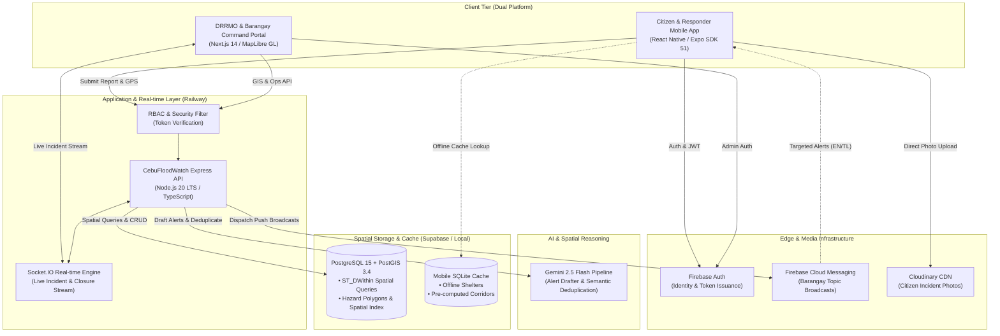

# CebuFloodWatch (StormGate)

> **Flood Warning & Evacuation Management System for Metro Cebu**  
> *Capstone Project · University of Cebu - Banilad Campus (UC-B)*  
> *Governed by OmniGate AI · Dual-Platform (Mobile + Web)*

---

## 🌊 Overview

**CebuFloodWatch** is a dual-platform disaster risk reduction and emergency management (DRRM) system designed for Metro Cebu. It bridges the critical communication and situational awareness gap during urban flood events between:

1. **The Public (Citizens, Commuters, Evacuees)** via a cross-platform mobile app offering localized bilingual emergency warnings, offline evacuation corridor guidance, crowdsourced flood depth reporting (< 3 taps), and a family safety network.
2. **Local Government Units & Emergency Responders (City DRRMO, Barangay Focals, First Responders)** via a real-time command portal featuring MapLibre GIS hazard overlays, AI-assisted bilingual alert drafting, dynamic road closure controls, and evacuation center capacity management.

---

## 📐 System Architecture



---

## 🛠️ Technology Stack

| Layer | Technology | Key Capabilities & Rationale |
| :--- | :--- | :--- |
| **Mobile App** | **React Native (Expo SDK 51)** | Cross-platform iOS/Android, MapLibre Native, `expo-sqlite` offline cache, FCM push. |
| **Web Portal** | **Next.js 14 (App Router)** | Server-side rendering, MapLibre GL JS, TailwindCSS, high-density GIS command center. |
| **Backend API** | **Node.js 20 LTS + Express** | RESTful services, Socket.IO WebSockets, PostGIS spatial queries, TypeScript. |
| **Database** | **PostgreSQL 15 + PostGIS 3.4** | Spatial indexing (`GIST`), `ST_DWithin` incident clustering, hazard polygon containment. |
| **AI / LLM** | **Google Gemini 2.5 Flash** | Structured JSON schema generation for bilingual (EN + TL) emergency alert drafting and spatial deduplication. |
| **Auth & Push** | **Firebase Auth + FCM** | JWT tokens, 3-tier custom claims, topic-based push subscriptions (`topics/barangay_{id}`). |
| **Media Storage**| **Cloudinary** | Secure direct-to-cloud photo uploads for crowdsourced verification. |
| **Map Data** | **OpenStreetMap + UP NOAH** | Vector basemaps with static 5/25/100-year flood hazard return period GeoJSON overlays. |

---

## 🛡️ Role-Based Access Control (RBAC) Matrix

| Action / Permission | City DRRMO Admin | Barangay Focal | First Responder | Public / Citizen |
| :--- | :---: | :---: | :---: | :---: |
| **View Real-Time Live Map** | ✅ (All Metro Cebu) | ✅ (Own Barangay) | ✅ (Operational View) | ✅ (Public Hazard Map) |
| **Submit Crowdsourced Flood Report** | ✅ | ✅ | ✅ | ✅ |
| **Manage Road Closures / Passability** | ✅ | ✅ (Own Barangay) | ❌ | ❌ |
| **Update Evacuation Center Status** | ✅ | ✅ (Own Barangay) | ✅ (Field Occupancy) | ❌ |
| **Draft Emergency Alerts** | ✅ | ✅ | ❌ | ❌ |
| **Approve & Publish AI Alerts (FCM)** | ✅ | ❌ | ❌ | ❌ |
| **Manage User Roles & System Accounts** | ✅ | ❌ | ❌ | ❌ |
| **Offline Shelter & Corridor Lookup** | ✅ | ✅ | ✅ | ✅ |
| **Safety Network & "Mark Safe" Broadcast**| ✅ | ✅ | ✅ | ✅ |

---

## 📂 Project Monorepo Structure

```text
StormGate/
├── apps/
│   ├── api/          # Express REST API, Socket.IO, PostGIS migrations & AI services
│   ├── web/          # Next.js 14 command portal & GIS monitoring dashboard
│   └── mobile/       # React Native Expo cross-platform public & responder app
├── packages/
│   └── shared/       # Shared TypeScript types, Zod schemas, GIS utilities & constants
├── docs/             # Technical specifications, architecture, and schema guides
├── .omnigate/        # OmniGate AI governance engine, rules, and agents
└── developer-handbook/# Developer onboarding and best-practice guides
```

---

## 🚀 Getting Started

### Prerequisites
- **Node.js**: `v20.x` LTS or later
- **Package Manager**: `npm` (v10+)
- **Database**: PostgreSQL 15+ with PostGIS 3.4 extension (Supabase or local Docker)
- **Expo CLI**: For mobile application testing (`npx expo`)

### Quick Setup

```powershell
# 1. Clone repository
git clone https://github.com/oznerta/CebuFloodWatch.git
cd CebuFloodWatch

# 2. Install monorepo dependencies
npm install

# 3. Configure environment variables
cp .env.example .env

# 4. Run database migrations
npm run db:migrate --workspace=apps/api

# 5. Start development servers
npm run dev
```

---

## 📚 Documentation Index

- [Architecture & Data Flow](docs/ARCHITECTURE.md)
- [Database Schema & PostGIS Guide](docs/DATABASE_SCHEMA.md)
- [API & WebSocket Specification](docs/API_SPECIFICATION.md)
- [10-Week Implementation Roadmap](docs/ROADMAP.md)
- [OmniGate AI Governance Manual](OMNIGATE.md)

---

## 📄 License & Attribution
Developed as part of the Senior Capstone Project at **University of Cebu - Banilad Campus (UC-B)**.  
Flood Hazard data courtesy of **UP NOAH** and **OpenStreetMap Contributors**.
