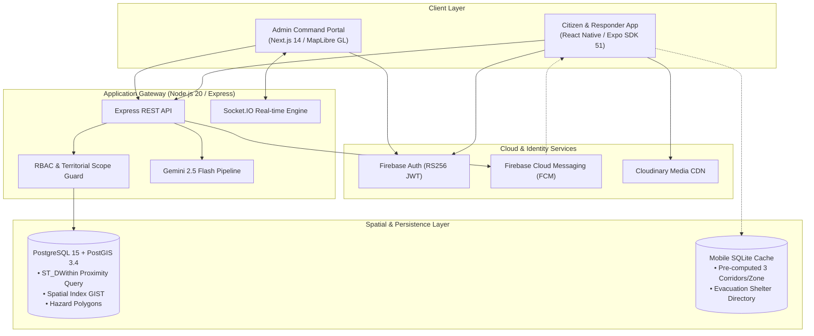

# System Architecture & Technical Specification — CebuFloodWatch

## 1. System Overview

CebuFloodWatch is an end-to-end disaster response and monitoring platform specifically optimized for urban flooding conditions in Metro Cebu. The architecture combines real-time geospatial processing, offline edge resilience, and AI-assisted operational intelligence.



---

## 2. Core Functional Subsystems

### 2.1 Crowdsourced Citizen Reporting Pipeline (`[MOB-4]` / `[WEB-1]`)
1. **Submission**: Public user triggers report in < 3 taps:
   - Auto-fetches GPS coordinates via `expo-location`.
   - Selects flood depth severity (`ankle`, `knee`, `waist`, `chest`, `above_head`).
   - Optional photo uploaded directly to Cloudinary; image URL returned.
2. **Ingestion & Spatial Snapping**:
   - Backend ingests report, transforms `(lon, lat)` into `ST_SetSRID(ST_Point(lon, lat), 4326)`.
   - Identifies enclosing Barangay via `ST_Intersects(location_geom, barangay.boundary_geom)`.
3. **Real-time Broadcast**:
   - Backend emits `report:new` event over Socket.IO to connected DRRMO and Barangay Focal dashboard clients.

### 2.2 LLM Alert Drafter & Translation Pipeline (`[WEB-2]` / `[MOB-1]`)
1. **Input**: Operator writes raw notes (e.g. *"Suba river overflowing near Mabolo bridge, evacuate immediately"*).
2. **AI Inference**: Backend passes notes to **Google Gemini 2.5 Flash** with strict JSON schema:
   ```json
   {
     "severity": "critical",
     "title_en": "Evacuation Warning: Suba River Overflow (Mabolo)",
     "title_tl": "Babala sa Paglikas: Pag-apaw ng Ilog Suba (Mabolo)",
     "body_en": "Water levels have exceeded critical limits near Mabolo bridge. Move to designated evacuation centers.",
     "body_tl": "Ang antas ng tubig ay lumagpas sa kritikal na limitasyon malapit sa tulay ng Mabolo. Lumikas sa mga itinalagang evacuation center."
   }
   ```
3. **Approval Gate**: DRRMO Admin reviews and approves draft in web UI.
4. **Push Dispatch**: Backend dispatches alert to FCM topic `/topics/barangay_<id>` within 10 seconds.

### 2.3 Two-Tier Offline Evacuation Routing (`[MOB-3]` / `[WEB-3]`)
1. **Tier 1 (Offline Resilience)**: Mobile app bundles a pre-computed SQLite database containing 3 safe corridors per barangay zone leading to high-ground shelters.
2. **Tier 2 (Admin Passability Toggle)**: When DRRMO flags a road as `blocked` in the web portal, the passability flag propagates to connected clients to discount the blocked corridor.

---

## 3. High-Availability & Deployment Topology

| Component | Host / Runtime | Scale & HA Strategy |
| :--- | :--- | :--- |
| **Web Dashboard** | **Vercel** | Serverless Edge CDN + SSR with automatic rollback. |
| **Backend API** | **Railway Linux Container** | Containerized Node.js with horizontal scaling and healthcheck probes. |
| **Spatial Database** | **Supabase Managed Postgres** | Automated daily backups, PostGIS 3.4 spatial indices, connection pooling. |
| **Mobile App** | **Expo EAS / Stores** | Offline-capable local SQLite data layer; OTA updates via Expo Updates. |
