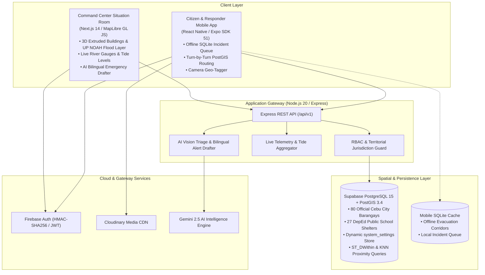

# System Architecture & Technical Specification — CebuFloodWatch

## 1. System Overview

CebuFloodWatch is an end-to-end disaster response and flood monitoring platform tailored for the urban geography and hydrological basins of Metro Cebu. The architecture combines real-time geospatial processing, 3D extruded urban mapping, offline edge resilience, and AI-assisted operational intelligence.

---

## 2. Core Functional Subsystems

### 2.1 3D Command Center & Map Engine (`apps/web`)
1. **Vector & 3D Extrusion Engine**: Built with **MapLibre GL JS** featuring:
   - **3D Extruded Buildings**: Rendered dynamically via vector building footprints with calculated heights (`render_height`).
   - **45° Axonometric Perspective**: Pitched tactical viewpoint allowing operators to see water levels interacting with building foundations.
   - **DOST-UP NOAH Flood Hazard Overlay**: Official 100-Year Flood Return simulation model (`ph072217000_fh100yr_10m`) layered below buildings so water floods streets naturally.
   - **Google Clean Basemaps**: Automated `apistyle` POI stripping removing commercial pins (resorts, hotels, malls) to prioritize disaster markers.
   - **80 Administrative Barangays**: Exact multi-polygon territorial boundaries sourced from PSA / UN OCHA (HDX).

### 2.2 Live Hydrological Telemetry & River Basins
Monitors the 5 primary river catchment channels of Cebu City:
- **Guadalupe River Basin** (Guadalupe / Capitol Site)
- **Mahiga Creek Basin** (Mabolo / Subangdaku border)
- **Lahug / Kamputhaw River Basin** (Lahug / Kamputhaw)
- **Kinalumsan River Basin** (Mambaling / Labangon)
- **Bulacao River Basin** (Bulacao / Inayawan)
- **Cebu Port Tidal Station**: High/low tide predictions integrated with river outflow backflow risk calculations.

### 2.3 Crowdsourced Citizen Reporting Pipeline (`apps/mobile` + `apps/api`)
1. **Submission**: Public user triggers report with automatic GPS coordinate acquisition via `expo-location`.
2. **Offline-First Resilience**: If cellular networks are submerged or down, reports are cached locally in **SQLite** and automatically synchronized upon reconnect.
3. **Media CDN**: Citizen flood photos upload directly to **Cloudinary** with optimized image delivery.
4. **AI Vision Triage**: Images analyzed with Gemini Vision to verify flood depth (`ankle`, `knee`, `waist`, `chest`, `above_head`) and flag false positives.

### 2.4 AI Bilingual Emergency Broadcast Drafter
1. **Input**: Operator writes brief incident notes or selects one-tap scenario presets (Flash Flood, Dam Spillway, High Tide Storm Surge, Mountain Landslide).
2. **AI Inference**: Backend passes prompt to **Gemini 2.5 Flash / Pro** producing strict bilingual outputs in **English** and **Cebuano (Bisaya)**.
3. **Approval & Broadcast**: CDRRMO admin reviews, adjusts, and broadcasts directly to citizen mobile apps and SMS gateways.

### 2.5 Evacuation Shelters & Turn-by-Turn Safe Routing
1. **27 Designated DepEd Public Schools**: Seeded from official DepEd GIS registries with realistic classroom capacities (400 – 3,500 evacuees).
2. **Spatial KNN Distance Ordering**: PostGIS `<->` operator calculates immediate real-time proximity to open facilities with available capacity.
3. **Dynamic Operator Adjustments**: Real-time inline headcount adjustment with custom increment steppers.

---

## 3. High-Availability & Deployment Topology

| Component | Host / Runtime | Scale & HA Strategy |
| :--- | :--- | :--- |
| **Web Dashboard** | **Vercel** | Serverless Edge CDN + SSR with instant deployment previews. |
| **Backend API** | **Railway Linux Container** | Containerized Node.js 20 with healthcheck probes and auto-recovery. |
| **Spatial Database** | **Supabase Managed Postgres** | PostGIS 3.4 spatial indices, connection pooler, automated backups. |
| **Mobile App** | **Expo EAS / Stores** | Offline-capable local SQLite data layer; OTA updates via Expo. |
