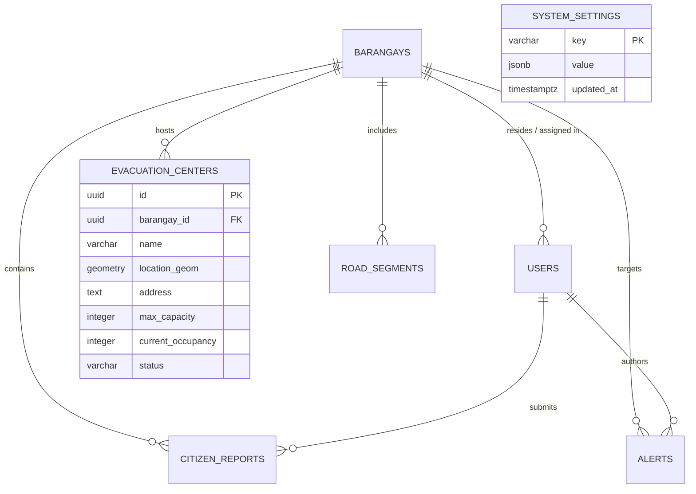

# Database Schema & PostGIS Specification — CebuFloodWatch

## 1. Entity Relationship Overview



---

## 2. Table Definitions & DDL

### 2.1 `barangays`
Stores the official territorial boundaries (80 Cebu City Barangays) sourced from PSA & UN OCHA / HDX.
```sql
CREATE TABLE public.barangays (
    id UUID PRIMARY KEY DEFAULT gen_random_uuid(),
    name VARCHAR(100) NOT NULL UNIQUE,
    psgc_code VARCHAR(20) NOT NULL UNIQUE,
    boundary_geom GEOMETRY(MultiPolygon, 4326),
    center_geom GEOMETRY(Point, 4326) NOT NULL,
    risk_level VARCHAR(20) NOT NULL DEFAULT 'low' CHECK (risk_level IN ('low', 'medium', 'high', 'severe')),
    created_at TIMESTAMPTZ NOT NULL DEFAULT NOW()
);
CREATE INDEX idx_barangays_boundary_geom ON public.barangays USING GIST(boundary_geom);
CREATE INDEX idx_barangays_center_geom ON public.barangays USING GIST(center_geom);
```

### 2.2 `users`
System user accounts across all operational tiers (`admin`, `barangay_focal`, `first_responder`, `citizen`).
```sql
CREATE TABLE public.users (
    id UUID PRIMARY KEY DEFAULT gen_random_uuid(),
    firebase_uid VARCHAR(128) NOT NULL UNIQUE,
    email VARCHAR(255) NOT NULL UNIQUE,
    full_name VARCHAR(150) NOT NULL,
    role VARCHAR(30) NOT NULL DEFAULT 'citizen' CHECK (role IN ('admin', 'barangay_focal', 'first_responder', 'citizen')),
    barangay_id UUID REFERENCES public.barangays(id) ON DELETE SET NULL,
    phone_number VARCHAR(30),
    is_active BOOLEAN NOT NULL DEFAULT TRUE,
    created_at TIMESTAMPTZ NOT NULL DEFAULT NOW(),
    updated_at TIMESTAMPTZ NOT NULL DEFAULT NOW()
);
CREATE INDEX idx_users_role ON public.users(role);
CREATE INDEX idx_users_barangay_id ON public.users(barangay_id);
```

### 2.3 `citizen_reports`
Geotagged crowdsourced flood observations submitted via the mobile app with optional Cloudinary photo evidence.
```sql
CREATE TABLE public.citizen_reports (
    id UUID PRIMARY KEY DEFAULT gen_random_uuid(),
    user_id UUID REFERENCES public.users(id) ON DELETE SET NULL,
    barangay_id UUID REFERENCES public.barangays(id) ON DELETE CASCADE,
    incident_cluster_id UUID,
    location_geom GEOMETRY(Point, 4326) NOT NULL,
    latitude DOUBLE PRECISION NOT NULL,
    longitude DOUBLE PRECISION NOT NULL,
    flood_depth_level VARCHAR(20) NOT NULL CHECK (flood_depth_level IN ('ankle', 'knee', 'waist', 'chest', 'above_head')),
    description TEXT,
    photo_url TEXT,
    status VARCHAR(20) NOT NULL DEFAULT 'pending' CHECK (status IN ('pending', 'verified', 'resolved', 'rejected')),
    created_at TIMESTAMPTZ NOT NULL DEFAULT NOW(),
    updated_at TIMESTAMPTZ NOT NULL DEFAULT NOW()
);
CREATE INDEX idx_citizen_reports_location_geom ON public.citizen_reports USING GIST(location_geom);
CREATE INDEX idx_citizen_reports_barangay_id ON public.citizen_reports(barangay_id);
CREATE INDEX idx_citizen_reports_status ON public.citizen_reports(status);
```

### 2.4 `evacuation_centers`
Designated public school evacuation centers (27 DepEd Cebu City Public Schools) with calculated capacities and live headcount.
```sql
CREATE TABLE public.evacuation_centers (
    id UUID PRIMARY KEY DEFAULT gen_random_uuid(),
    barangay_id UUID NOT NULL REFERENCES public.barangays(id) ON DELETE CASCADE,
    name VARCHAR(150) NOT NULL,
    location_geom GEOMETRY(Point, 4326) NOT NULL,
    address TEXT NOT NULL,
    max_capacity INTEGER NOT NULL DEFAULT 500,
    current_occupancy INTEGER NOT NULL DEFAULT 0,
    status VARCHAR(20) NOT NULL DEFAULT 'open' CHECK (status IN ('open', 'full', 'closed')),
    supply_notes TEXT,
    contact_person VARCHAR(100),
    contact_number VARCHAR(30),
    created_at TIMESTAMPTZ NOT NULL DEFAULT NOW(),
    updated_at TIMESTAMPTZ NOT NULL DEFAULT NOW()
);
CREATE INDEX idx_evacuation_centers_location_geom ON public.evacuation_centers USING GIST(location_geom);
CREATE INDEX idx_evacuation_centers_status ON public.evacuation_centers(status);
```

### 2.5 `road_segments`
Road sections monitored for passability and vehicle clearance (Sedan vs SUV vs Truck).
```sql
CREATE TABLE public.road_segments (
    id UUID PRIMARY KEY DEFAULT gen_random_uuid(),
    barangay_id UUID REFERENCES public.barangays(id) ON DELETE CASCADE,
    name VARCHAR(150) NOT NULL,
    line_geom GEOMETRY(LineString, 4326) NOT NULL,
    is_blocked BOOLEAN NOT NULL DEFAULT FALSE,
    block_reason TEXT,
    blocked_at TIMESTAMPTZ,
    updated_by UUID REFERENCES public.users(id) ON DELETE SET NULL,
    created_at TIMESTAMPTZ NOT NULL DEFAULT NOW(),
    updated_at TIMESTAMPTZ NOT NULL DEFAULT NOW()
);
CREATE INDEX idx_road_segments_line_geom ON public.road_segments USING GIST(line_geom);
CREATE INDEX idx_road_segments_is_blocked ON public.road_segments(is_blocked);
```

### 2.6 `alerts`
Official bilingual emergency advisories (English + Cebuano Bisaya) drafted with Gemini AI and broadcast to responders and citizens.
```sql
CREATE TABLE public.alerts (
    id UUID PRIMARY KEY DEFAULT gen_random_uuid(),
    author_id UUID NOT NULL REFERENCES public.users(id) ON DELETE RESTRICT,
    barangay_id UUID REFERENCES public.barangays(id) ON DELETE CASCADE, -- NULL for citywide
    severity VARCHAR(20) NOT NULL CHECK (severity IN ('advisory', 'watch', 'warning', 'critical')),
    title_en VARCHAR(200) NOT NULL,
    title_tl VARCHAR(200) NOT NULL, -- Cebuano / Tagalog localization
    body_en TEXT NOT NULL,
    body_tl TEXT NOT NULL,
    raw_prompt_input TEXT,
    is_ai_drafted BOOLEAN NOT NULL DEFAULT FALSE,
    status VARCHAR(20) NOT NULL DEFAULT 'draft' CHECK (status IN ('draft', 'approved', 'published', 'archived')),
    fcm_message_id VARCHAR(100),
    published_at TIMESTAMPTZ,
    created_at TIMESTAMPTZ NOT NULL DEFAULT NOW()
);
CREATE INDEX idx_alerts_barangay_id ON public.alerts(barangay_id);
CREATE INDEX idx_alerts_status ON public.alerts(status);
```

### 2.7 `system_settings`
Dynamic runtime configuration table persisting AI models, API gateway states, and emergency thresholds across system restarts.
```sql
CREATE TABLE public.system_settings (
    key VARCHAR(100) PRIMARY KEY,
    value JSONB NOT NULL,
    updated_at TIMESTAMPTZ NOT NULL DEFAULT NOW()
);
```

---

## 3. Essential Spatial Queries

### 3.1 Spatial KNN Nearest Open Shelter Search
```sql
SELECT id, name, address, max_capacity, current_occupancy,
       ST_Distance(location_geom, ST_SetSRID(ST_Point($1, $2), 4326)) AS distance_degrees
FROM public.evacuation_centers
WHERE status = 'open'
  AND current_occupancy < max_capacity
ORDER BY location_geom <-> ST_SetSRID(ST_Point($1, $2), 4326)
LIMIT 5;
```

### 3.2 Find Incident Reports within 150m for Spatial Deduplication
```sql
SELECT id, flood_depth_level, description, latitude, longitude, created_at
FROM public.citizen_reports
WHERE ST_DWithin(
    location_geom,
    ST_SetSRID(ST_Point($1, $2), 4326),
    0.00135 -- ~150 meters
)
AND created_at >= NOW() - INTERVAL '90 minutes'
AND status != 'rejected';
```
