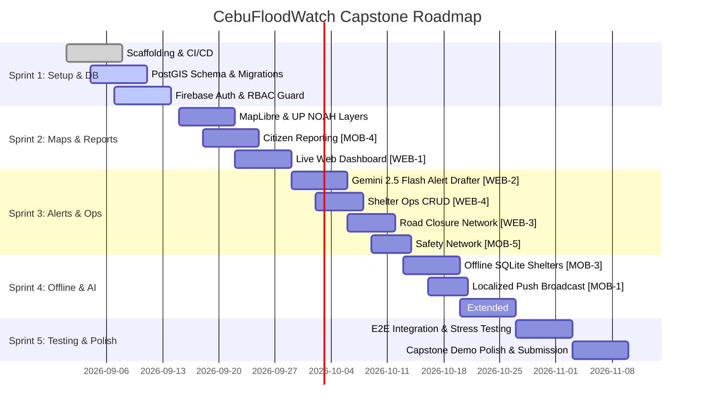

# 10-Week Implementation Roadmap — CebuFloodWatch

## 1. Overview & Phasing

A 10-week capstone delivery plan broken down into 2-week agile sprints.

---

## 2. Sprint Deliverables & Acceptance Criteria

### Sprint 1 (Weeks 1–2): Foundation, Auth & Spatial Database
- **Deliverables**: Monorepo scaffolding, PostgreSQL 15 + PostGIS 3.4 migrations, Express API skeleton, Firebase Auth token verification, RBAC middleware.
- **Acceptance Criteria**: Database migration scripts run cleanly; valid JWTs pass authentication; invalid role claims return HTTP 403.

### Sprint 2 (Weeks 3–4): Core Geospatial Engine & Citizen Reporting
- **Deliverables**: MapLibre GL integration on Web and Mobile; UP NOAH GeoJSON hazard overlays; `[MOB-4]` Citizen Reporting; `[WEB-1]` Central Monitoring Dashboard.
- **Acceptance Criteria**: Citizen report submitted in < 3 taps appears on admin dashboard map in < 15 seconds.

### Sprint 3 (Weeks 5–6): AI Alert Drafting, Operations & Safety Network
- **Deliverables**: `[WEB-2]` Gemini 2.5 Flash bilingual alert drafter; FCM push dispatch; `[WEB-4]` Evacuation Center operations; `[WEB-3]` Dynamic road closure manager; `[MOB-5]` Safety network.
- **Acceptance Criteria**: Admin creates structured EN+TL alert draft from raw text in < 5 seconds; push alert arrives at target barangay mobile devices within 30 seconds of approval.

### Sprint 4 (Weeks 7–8): Offline Resilience Mode & Extended Features
- **Deliverables**: `[MOB-3]` Offline SQLite shelter directory and 3 safe corridors; `[MOB-1]` localized push optimization; `[EXT-2]` AI semantic report deduplication.
- **Acceptance Criteria**: When in Airplane Mode, mobile app renders shelter directory and at least 1 safe evacuation corridor.

### Sprint 5 (Weeks 9–10): Integration Testing, Simulation & Final Submission
- **Deliverables**: End-to-end integration testing, 20 concurrent report simulation, peer review, documentation packaging.
- **Acceptance Criteria**: Zero critical test failures; complete capstone presentation package.
