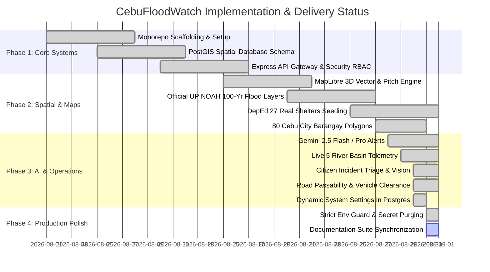

# Implementation Roadmap & Milestone Tracker — CebuFloodWatch

## 1. Project Phase Tracker

---

## 2. Milestone Deliverables & Verification Status

### Phase 1: Foundation, Spatial Database & Security [COMPLETED]
- [x] Monorepo structure with Next.js 14 Web, Express API, React Native / Expo Mobile, and Shared TypeScript packages.
- [x] Supabase PostgreSQL with PostGIS 3.4 spatial indices (`GIST`) on all geospatial columns.
- [x] Fail-fast environment configuration with zero fallback strings committed to git.
- [x] Role-Based Access Control (RBAC) with cryptographic HMAC-SHA256 JWT validation.

### Phase 2: 3D Command Center & Official GIS Assets [COMPLETED]
- [x] MapLibre GL JS engine with 3D building extrusions and $45^\circ$ tactical axonometric pitch.
- [x] Conversion and integration of official DOST-UP NOAH 100-Year Flood Return simulation (`ph072217000_fh100yr_10m`).
- [x] Spatial join and ingestion of 27 designated DepEd Cebu City Public School evacuation shelters with capacity calculations.
- [x] Multi-polygon boundaries for all 80 official Cebu City barangays from PSA & UN OCHA / HDX.
- [x] Google Clean (POI-stripped) basemaps via automated raster styling parameters.

### Phase 3: AI Intelligence, Telemetry & Operations [COMPLETED]
- [x] Gemini AI-assisted bilingual emergency advisory drafting (English + Cebuano Bisaya) with one-tap disaster presets.
- [x] Live sensor telemetry ingestion for 5 major Cebu City river basins (Guadalupe, Mahiga, Lahug, Kinalumsan, Bulacao) + Cebu Port tidal gauge.
- [x] Citizen crowdsourced flood reporting with Cloudinary photo storage and AI vision triage.
- [x] Interactive road passability manager with vehicle clearance thresholds (Sedan, SUV, Heavy Truck).
- [x] Runtime administrative system settings persisted dynamically into `public.system_settings` table.

### Phase 4: Documentation, Verification & Deployment [ACTIVE]
- [x] Secret scanning and strict env variable validation across all packages.
- [x] Synchronized developer handbook, API specifications, and architecture documentation.
- [ ] End-to-end Capstone defense demo execution and final presentation packaging.
